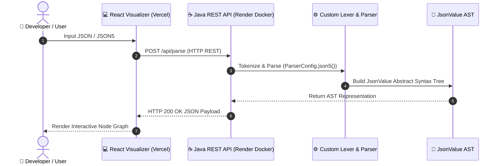

# JSON Parser & Node Graph Visualizer

[](https://jdk.java.net/17/)
[](https://json-parser-sooty.vercel.app)
[](https://json-parser-api.onrender.com/health)
[](Dockerfile)
[](#building--testing)

A robust, dependency-free JSON parsing library and REST API service for Java, accompanied by a modern **React Flow Node Graph Visualizer**. Designed for performance, correctness, and flexibility, offering an array of capabilities extending beyond basic parsing—including querying, schema validation, diffing, zero-allocation streaming, and live visualization.

---

## 🌟 Highlights
- **Zero Core Dependencies**: Core library strictly relies on standard Java (`java.base`).
- **RFC 8259 Compliant & JSON5 Support**: Handles standard JSON as well as JSON5 features (comments, single quotes, unquoted keys, hex numbers, trailing commas).
- **Interactive React Visualizer**: Live web application deployed on Vercel, powered 100% by the custom Java Parser backend deployed on Render.
- **Built-in REST API Server**: Zero-dependency HTTP REST API containerized with Docker (`/api/parse`, `/api/diff`, `/health`).
- **Advanced Features**: Data Binding / Object Mapping, JSONPath queries, schema validation, structural diffing, and zero-allocation streaming.
- **Maven & Docker Ready**: Easily deployable to any cloud platform (Render, Railway, AWS, Docker).

---

## 🌐 Live Demos
- **Visualizer App**: [json-parser-sooty.vercel.app](https://json-parser-sooty.vercel.app)
- **Backend Health Check**: [json-parser-api.onrender.com/health](https://json-parser-api.onrender.com/health)

---

## 🏗️ Architecture & Data Flow

The project consists of a high-performance Java compiler frontend (Lexer + Recursive Descent Parser) exposed as a REST API and visualized through a React Node Graph frontend.



---

## 📦 Installation & Setup

### 1. Maven Dependency
Add the dependency to your `pom.xml`:

```xml
<dependency>
    <groupId>com.jsonparser</groupId>
    <artifactId>json-parser</artifactId>
    <version>1.0.0-SNAPSHOT</version>
</dependency>
```

Alternatively, clone and build locally:
```sh
git clone https://github.com/Animesh-86/JSON-Parser.git
cd JSON-Parser
mvn clean install
```

---

## ⚡ Quick Start (Java Code)

```java
import com.jsonparser.core.*;

public class Example {
    public static void main(String[] args) {
        String json = "{\"name\":\"Animesh\",\"skills\":[\"Java\",\"ML\"]}";
        
        // Initialize parser
        Parser parser = new Parser(json);
        JsonObject root = (JsonObject) parser.parse();
        
        System.out.println(root.get("name")); // "Animesh"
        
        // Serialize back to JSON with 2-space indentation (pretty print)
        System.out.println(root.toJson(2));
    }
}
```

---

## 🛠️ Features & Usage

### 1. JSONPath Querying
Navigate nested structures intuitively:
```java
JsonQuery query = new JsonQuery(rootObject);
JsonValue result = query.query("$.skills[0]"); 
// Returns JsonString("Java")
```

### 2. Structural JSON Diffing (RFC 6901)
Detect structural and value differences between two JSON objects:
```java
JsonDiff.DiffResult result = JsonDiff.diff(oldObj, newObj);
System.out.println(result.toPrettyString());
// REP /age: 20 -> 21
// ADD /city => Vadodara
```

### 3. Schema Validation
Ensure JSON structure and data types match expectations:
```java
Map<String, Object> schema = Map.of(
    "name", "string",
    "age", "number"
);
boolean isValid = JsonValidator.validate(rootObject, schema);
```

### 4. Full JSON5 Support
Parse human-readable JSON5 configuration files with single quotes, unquoted keys, and comments:
```java
ParserConfig config = ParserConfig.json5();
Parser parser = new Parser("{ name: 'Animesh', /* comment */ hex: 0xFF }", config);
```

### 5. Object Mapping / Data Binding
Map JSON directly to your Java POJOs using reflection, supported by `@JsonName` and `@JsonIgnore` annotations:
```java
JsonMapper mapper = new JsonMapper();
User user = mapper.readValue(rootObject, User.class);
```

### 6. Zero-Allocation Streaming
Achieve maximum throughput for multi-gigabyte JSON files using a shared `char[]` buffer to eliminate object allocation and GC pauses:
```java
ZeroAllocStreamParser parser = new ZeroAllocStreamParser(reader);
while (parser.hasNext()) {
    JsonToken token = parser.nextToken();
    if (token == JsonToken.STRING) {
        CharSequence value = parser.getText(); // Direct buffer slice
    }
}
```

---

## 🚀 REST API Endpoints & Docker Deployment

The Java project includes a built-in zero-dependency HTTP server ([Server.java](file:///c:/CipherVault/Code/Projects/JSON%20Parser/json_parser/src/main/java/com/jsonparser/server/Server.java)).

| Endpoint | Method | Description |
| :--- | :--- | :--- |
| `/health` | `GET` | Service health status |
| `/api/parse` | `POST` | Parses raw JSON/JSON5 string via Java Engine |
| `/api/diff` | `POST` | Computes diff between `{ "old": ..., "new": ... }` |

### Running with Docker:
```sh
# Build Docker image
docker build -t json-parser-api .

# Run Docker container
docker run -p 8080:8080 json-parser-api
```

---

## 🎨 Node Graph Visualizer (React Web App)

Located in the [visualizer](file:///c:/CipherVault/Code/Projects/JSON%20Parser/json_parser/visualizer) directory. Built with **React 19**, **Vite**, **TypeScript**, and **React Flow** (`@xyflow/react`).

* **Live Demo**: [json-parser-sooty.vercel.app](https://json-parser-sooty.vercel.app)
* **Features**: Real-time Java API parsing, search highlighting, Left-to-Right layouting via Dagre, and PNG exports.

```sh
cd visualizer
npm install
npm run dev
```

---

## 🧪 Building & Testing

To execute the unit test suite (30+ tests passing):

```sh
mvn clean test
```

---

## 👨‍💻 Author
Created with ❤️ by **[Animesh Sharma](https://github.com/Animesh-86)**.
