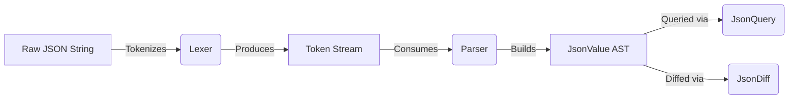
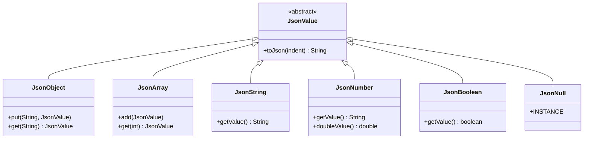

# JSON Parser


A robust, dependency-free JSON parsing library for Java. Designed for performance, correctness, and flexibility, offering an array of capabilities extending beyond basic parsing—including querying, schema validation, diffing, and streaming.

## Highlights
- **Zero Dependencies**: Core library strictly relies on standard Java (`java.base`).
- **RFC 8259 Compliant**: Fully handles escape sequences, unicode, decimals, exponents, and proper JSON grammar.
- **Advanced Features**: JSONPath queries, schema validation, structural diffing, and event-driven streaming parser.
- **Maven Ready**: Drop-in compatible with modern Java build ecosystems.

---

## Installation

Add the dependency to your `pom.xml`:

```xml
<dependency>
    <groupId>com.jsonparser</groupId>
    <artifactId>json-parser</artifactId>
    <version>1.0.0-SNAPSHOT</version>
</dependency>
```

Alternatively, clone and build locally:
```sh
git clone https://github.com/Animesh-86/json-parser.git
cd json-parser
mvn clean install
```

---

## Quick Start

```java
import com.jsonparser.core.*;

public class Example {
    public static void main(String[] args) {
        String json = "{\"name\":\"Animesh\",\"skills\":[\"Java\",\"ML\"]}";
        
        Parser parser = new Parser(json);
        JsonObject root = (JsonObject) parser.parse();
        
        System.out.println(root.get("name")); // "Animesh"
        
        // Serialize back to JSON with indentation (pretty print)
        System.out.println(root.toJson(2));
    }
}
```

---

## Architecture

The parser is designed around a classic two-pass compiler frontend architecture, decoupled into specific modules for maintainability and extensibility.

### 1. Data Flow



### 2. Core Modules

- **Lexer**: Tokenizes the raw input string into JSON primitives (strings, numbers, booleans, structural characters). It handles all JSON whitespace, unicode escapes, and validation of raw literals.
- **Parser**: A recursive-descent parser that consumes tokens from the Lexer and builds a hierarchical in-memory Abstract Syntax Tree (AST) using `JsonValue` subclasses.
- **Streaming Parser**: A memory-efficient alternative (`JsonStreamParser`) that triggers user-defined callbacks on parsed tokens, rather than building a tree. Ideal for multi-gigabyte JSON files.

### 3. Class Hierarchy

All JSON data types inherit from the abstract base class `JsonValue`.



---

## Features

### 1. JSONPath Querying
Navigate nested structures intuitively.
```java
JsonQuery query = new JsonQuery(rootObject);
JsonValue result = query.query("$.skills[0]"); 
// Returns JsonString("Java")
```

### 2. JSON Diffing
Detect structural and value differences between two JSON objects (returns RFC 6901 compliant paths).
```java
JsonDiff.DiffResult result = JsonDiff.diff(oldObj, newObj);
System.out.println(result.toPrettyString());
// REP /age: 20 -> 21
// ADD /city => Vadodara
```

### 3. Schema Validation
Ensure JSON structure and data types match expectations.
```java
Map<String, Object> schema = Map.of(
    "name", "string",
    "age", "number"
);
boolean isValid = JsonValidator.validate(rootObject, schema);
```

### 4. Streaming Parsing
Process large payloads without `OutOfMemoryError`. Filter by key to skip irrelevant subtrees.
```java
Set<String> targetKeys = Set.of("target_key");
JsonStreamParser streamParser = new JsonStreamParser(reader, event -> {
    System.out.println(event.getType() + ": " + event.getValue());
}, targetKeys);

streamParser.parse();
```

---

## Building & Testing

To run the full test suite (JUnit 5):

```sh
mvn clean test
```

## Known Limitations
- Does not support JSON5 features (e.g., unquoted keys, single quotes, comments).
- Relies on `java.math.BigDecimal` for arbitrary-precision decimal numbers, which may have an overhead for extremely large files compared to native primitives.

## Author
Created by [Animesh-86](https://github.com/Animesh-86).
